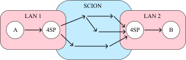
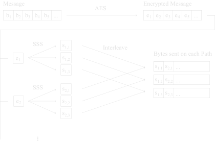

# SCION Secure Secret Sharing Proxy (4SP)

The 4SP enhances confidentiality in network communications. By employing a secret sharing
scheme, this proxy divides and transmits data across multiple paths. This approach significantly
increases the difficulty for any potential eavesdropper to obtain any information, as they would
need to intercept multiple data paths simultaneously in order to reassmble the shares generated by
the secret sharing scheme.
 

This project makes up of my bachelor thesis and is supervised by the [ETH Zurich Network Security
Group](https://netsec.ethz.ch). It makes deliberate use of the code from an initial proof of concept
also developed at the same group, the code can be found
[here](https://github.com/vincent10400094/scion/tree/feature-packet-splitting). The project is built
on top of [SCION](http://www.scion-architecture.net).

## Usage
From the outside, 4SP behaves like any other SCION IP Gateway. It advertises its multipath
connection as a regular link. The 4SP is intended to be setup between two communicating parties
ahead of time, for example between a company office in one country and the company's data center in
another country. The endhosts believe that there is a direct link between the two 4SPs, which they
use to send regular IP traffic to the other endhost. In reality, when traffic arrives at one 4SP, it
is split and sent over multiple paths. The 4SPs are responsible for reassembling the packets and
forwarding them to the next hop. Hence, there is no need for any changes to the endhosts to use 4SP.



## Encoding
4SP primarily uses Shamir's Secret Sharing Scheme (SSS) to encode the data to be sent on different
paths. The user can specify a number of used paths N and a threshold value T, which corresponds the
the number of paths one needs to know before being able to decrypt the communication. SSS is
unconditionally secure, so it guarantees that an attacker who compromises less than T paths can
never decrypt the communication, even if they have infinite computing resources.



## Path Selection
4SP uses a greedy path selection scheme that operates as follows: 
1. Transform the graph such that each node becomes an in_node and and out_node with a single edge
   between them. Assign each edge a cost of 0.1.
2. Find path with lowest cost by iterating over available paths and computing the sum of the edge
   weights of each path.
3. For each edge in the selected path: multiply its weight by 100 and multiply every edge between
   the same set of nodes as the given edge by 10 to encourage diversity.
4. Go to step 2. unless N paths have been found.


## Setup Instructions
This setup consists of two VMs, A and B, that have a SCION connection to eachother. For now, we will
have 4sp route two statically configured private IP networks to be able to send and receive IP
traffic directly on the hosts themselves. To get started, download the necessary files from GitHub
and make them executable:
```bash
wget https://github.com/Krecharles/scion-privacy-proxy/releases/download/v1.0.1/4sp # make sure this is the latest version
wget https://github.com/Krecharles/scion-privacy-proxy/releases/download/v1.0.0/4sp_setup.sh
chmod +x 4sp 4sp_setup.sh
```

Now execute the setup script to generate the configuration files. You will be prompted to enter for
the enter a private IP address that will be used for communication. Just enter A and B on each
machine respectively to choose the defaults 172.16.11.1 an 172.16.12.1 for this. You will also be
prompted for the destination SCION address, i.e. the SCION address of the other machine. You can
enter 3 for T and N for now. The script needs to be run with sudo to add a loopback to the chosen ip
addresses. This throws an error if the script is run more than once. You can ignore that error.

```bash
sudo ./4sp_setup.sh # for quick setup, enter A on one vm and B on the other
```

Now add the right capabilities to the 4sp so i can communicate with the other SCION processes.

```bash
sudo setcap cap_net_admin+eip 4sp 
```

Finally, you can now run 4sp. Wait for around 15 seconds until you have seen a line like 'Session is
running. T= 3 N= 3' on both machines.

```bash
./4sp --config 4sp.toml 
```

To test if the setup is working, ping the other machine via the 4sp:

```bash
ping 172.16.12.1 # to be run on VM A. Replace this the respective IP if you have not selected A/B in 4sp_setup.sh
```

Congratulations, you have successfully setup the 4sp!

To test the performance, you can run an `iperf3` test. Have `iperf3` listen on VM A:
```bash
iperf3 -s # on VM A
```
Now query it on VM B:
```bash
iperf3 -c 172.16.11.1 # on VM B
```


## Acknowledgements
This project makes use of [hashicorp's implementation of Shamir's secret sharing
scheme](github.com/hashicorp/vault). Their License is reproduced in the shamir.go file, which is the
only code copied from their repository. 